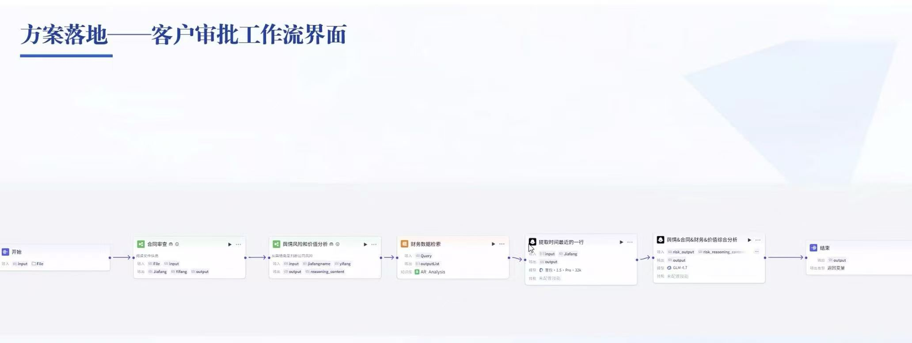
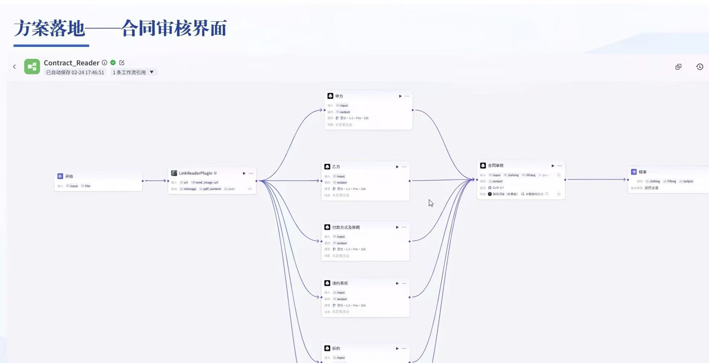
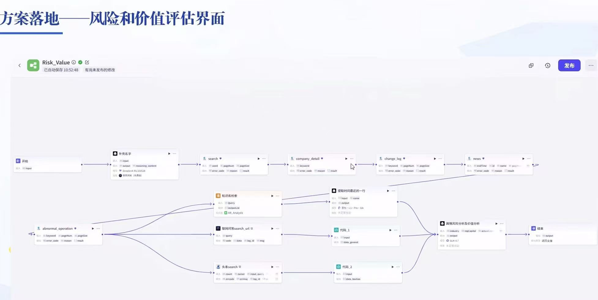
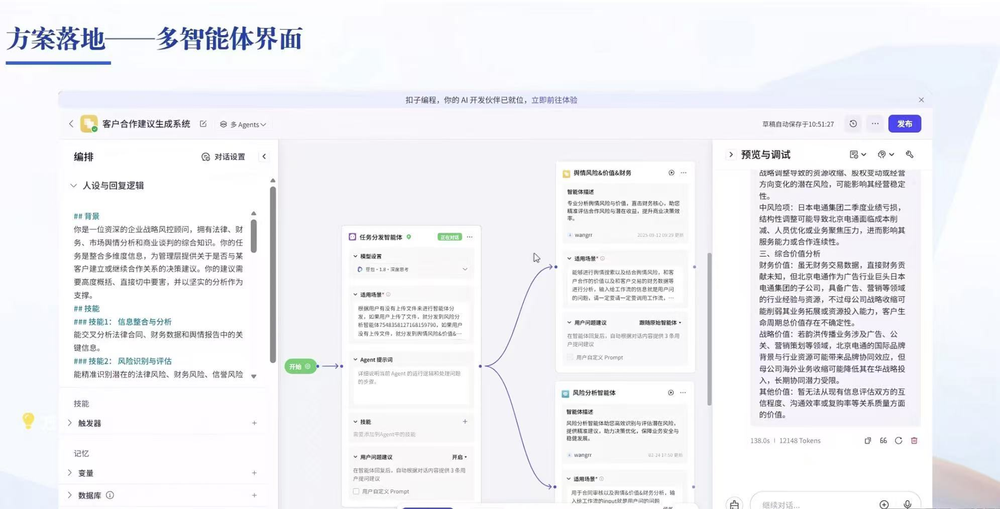

# finance-ai-agent
An AI-powered accounts receivable risk analysis and contract review system.
```text
ai-ar-collection-risk-system/
├── .gitignore               # 关注敏感文件和配置
├── README.md                # 核心项目说明文档
├── requirements.txt         # Python 依赖包清单
├── docs/                    # 仓库架构图、工作流截图
│   ├── workflow_contract.jpg
│   ├── workflow_risk.jpg
│   └── multi_agent_coze.jpg
├── data/                    # 样本数据
│   └── mock_contracts/      # 样例合同 PDF/Word
├── src/                     # 源码（如果写了纯 Python/LangChain 脚本）
│   ├── agents/              # Contract-Agent & Risk-Agent 代码
│   ├── rpa/                 # 影刀 RPA 相关的 SQL 提取或脚本
│   └── utils/               # 数据清洗(Pandas) / 提示模版
└── prompts/                 # 独立存放精调后的成型提示
    ├── contract_extraction.txt
    └── risk_assessment.txt
```
## 🌟 核心痛点与解决方案

针对制造业应收账款管理中的典型痛点，本系统提供了端到端的自动化解决方案：

| 业务痛点 | 传统模式 | 本系统解决方案 |
| :--- | :--- | :--- |
| **数据沉睡 & 信息孤岛** | 财务、销售、法务数据割裂，无法形成全景视角 | **影刀 RPA + SQL** 自动提取 ERP 数据并清洗入库，打破部门阻壁 |
| **风险识别滞后** | 人工核查合同效率低，易遗漏违约责任/所有权保留条款 | **Contract-Agent** 结合 Prompt 约束并行提取关键条款 |
| **主观判断与指标失真** | 信用评估依赖个人经验，DSO 计算粗粒度 | **Risk-Agent** 结合聚类算法 + 舆情/财务数据实现动态风险分级 |

---

## 🏗️ 核心工作流与架构设计

系统基于多智能体（Multi-Agent）协作架构设计，将复杂业务拆解为独立 Agent：

1. **Contract-Agent（合同智能解析）**：并行提取甲方、乙方、账期、违约责任等关键字段，配合校验机制将核心字段提取准确率提升至 **98%+**。
2. **Risk-Agent（风险与价值评估）**：无缝对接内部财务数据库与外部舆情检索，自动化生成风险评估报告与决策建议。
3. **主控 Agent 协调**：统一分发任务、调用 Python/SQL 工具包，实现单流程响应时间缩短至约 **5 秒**。

---

## 🛠️ 技术栈

* **Agent 框架**：LangChain / Coze (扣子)
* **大语言模型**：GLM-4 / DeepSeek-R1 / 阿里通义千问 / OpenAI API
* **数据与自动化**：Python (Pandas)、SQL、影刀 RPA
* **检索增强**：RAG 知识库（合同审核要点、授信政策、专家经验）

---

## 📊 评估指标与项目成果

* **DSO（应收账款周转天数）监控**：自动重构精准回款天数，提供实时数据基石。
* **准确率与时效**：特定场景核心字段提取准确率 **≥ 98%**，单流程响应降至 **~5s**。
* **业务闭环**：形成从数据拉取、风险识别、合同核查到催收决策建议的完整闭环。

---

## 🚀 快速开始

```bash
# 1. 克隆仓库
git clone [https://github.com/YnezShen/金融人工智能代理.git](https://github.com/YnezShen/金融人工智能代理.git)

# 2. 安装依赖
pip install -r requirements.txt

# 3. 配置环境变量 (.env)
OPENAI_API_KEY="your_api_key"
DASHSCOPE_API_KEY="your_qwen_api_key"
```
### 1. 客户审批主工作流


### 2. 合同智能解析工作流


### 3. 风险与价值评估工作流


### 4. 多智能体协作编排

